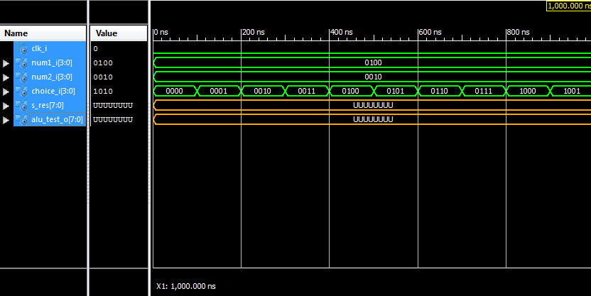

# Arithmetic logic unit project for Digital Electronics 1
## The Task
My task was creating a arithmetic logic unit that offers a method for the user to change the value of both numbers and change with operation should be displayed while using a coolboard unit. 
## The Execution
The code for this project was writen in ISE on a vritual windows 7 running in virtulal box on a windows 10 notebook. This was done because I ran into problems while instaling ISE on windows 10 as on C: it couldnt install itself and on D: it would crash if I tried to open any project. Clock_enable.vhd, driver_7seg.vhd and hex_to_7seg.vhd where taken from our previous projects that we wrote in class. ALU_tb_00.vhd, top.vhd and ALU.vhd where writen by myself. The theory for this project I looked up on both the Slovak and English wikipedia.
### ALU.vhd
In this vhd file is the main part of the project writen. I chose two numbers both with 4 bits giving us a max for 15 for each number and a choice number which is a 4 bit number that can be set to a number which will decide what operation we want the ALU to commit.

I used four constants,move, hun, ten & one used for the calculation in the proccess part of this code. In the port section I included 4 inputs, 4 outputs and 3 signals.
#### Inputs
+ **clk_i** gives us a frequency which allows the code to simulate its behavior, the use of clk_i was inspired by our previous projects. 
+ **num1_i & num2_i** short for number1 input and number2 input are both 4 birt number that can set with switches from 0 to 15 giving us 16 choices for each button and 256 number combination together. 
+ **choice_i** is a 4 bit number that can be set to a value from 0 to 15, this allows us to have 16 states meaning we can have 16 operation we can choose between.  
#### Output
+ **alu_disp_x_o** we have three outputs here each serving to display one digit of a number. alu_disp_1_o is for displaing the hundrets of a number, alu_disp_2_o is for tenths & alu_disp_3_o is for ones. For example if we got a number 157 disp_1 will display 1, disp_2 will display 5 and disp_3 will display 7.All three of them are 4 bit numbers and are used like binary coded decimals as the values I wanted to display where 0 to 9.
+ **alu_test_o** only serves for testing the functionality of the testbench. Its a 8bit number because the maximal number we can get is 225 coming from multiplying 15 by 15 which is 11100001 in binary which is 8 bits.
#### Signals
+ **s_res** a 8 bit number served to store the result after calculation. Just like alu_test_o there reason it is 8 bits is because the highest possible number being 225.
+ **s_res_int** converted number of s_res from binary to integer to help calculate the display numbers easier.
+ **s_digit_calc** a signal that temponareli stores the number of hundreds/tens/one in s_res_int.
#### Process
+ **case(choice_i)** its job is to look at the value of choice_i and choose the right operation.
+ **for 0000** is Add - it simply adds number 2 to number 1.
+ **for 0001** is Substraction - it simply substarcts number 2 from number 1.
+ **for 0010** is Multiplication - it multiplies number 1 with number 2.
+ **for 0011** is Division - it divides number 1 with number 2. 
+ **for 0100** is Incrementation for number 1 - it increments number 1 by one.
+ **for 0101** is Incrementation for number 2 - it increments number 2 by one.
+ **for 0110** is Decrementation for number 1 - it decrements number 1 by one.
+ **for 0111** is Decrementation for number 2 - it decrements number 2 by one.
+ **for 1000** is AND - Logical function number 1 AND number 2.
+ **for 1001** is OR - Logical function number 1 OR number 2.
+ **for 1010** is XOR - Logical function number 1 XOR number 2.
+ **for 1011** is Left Shift for for number 1 - moves the bits in number 1 to the left by the constat move.
+ **for 1100** is Left Shift for for number 2 - moves the bits in number 2 to the left by the constat move.
+ **for 1101** is Right Shift for for number 1 - moves the bits in number 1 to the right by the constat move.
+ **for 1110** is Right Shift for for number 2 - moves the bits in number 2 to the right by the constat move.
+ **for 1111** is Comparation - Compares number 1 to number 2 and writes the higher number into the result.
+ in the case the choice_i would be a different number than the ones above it will default to the add function.
+Bellow the end case; is my self made binary to binary coded decimal convertor. It function my converting s_res to an integer, and after that dividing the number with the constand hun which is 100. This gives us a real number which is  rounded down with s_digit_calc <= FLOOR(s_res_int / hun) gives us the number of hundreds in our number and writes it into the alu_disp_1_o with alu_disp_1_o <= STD_LOGIC_VECTOR(s_digit_calc) after that s_res_int <= s_res_int - s_digit_calc * hun which removes the hundreds from our number and makes it so we can go onto dividing with 10 to get the number of tens. This is repated twice so we can get the tens and ones and send each one to each alu_disp_x_o output.
### ALU_tb_00.vhd
The code for this testbench was inspired by the testbenches writen in our previous projects. We defined the port names andf values for our component ALU. We also defined the signals we would assign to the ALU ports in the uut. In the process we assign number 1 and number 2 each a number and set the choice_i to zero. After that  we have a for loop going from 0 to 15 each time incrementing choice_i by 1 so in each cycle we can test a diffferent ALU function.
### top.vhd
The code for top was inspired by previous top.vhd files from our previous projects. In the port section we chose to assign SW0_CPLD to SW3_CPLD to number 1 meaning each switch changes a diferent bit in numb1_i. We did the same for number 2 but with SW4_CPLD to SW7_CPLD and also for choice_i SW8_CPLD to SW11_CPLD.
+ **disp_seg_o & disp_dig_o** serves us to send our data to the seven segment display.
+ **s_num1(x)/s_num2(x)/s_choice(x)** the x here decides which bit is assigned to which switch. For example SW0_CPLD is assigned to s_num1(0) meaning by switching the switch on and of we can edit the first bit of the first number while the program is running.
+ **sub-blocks** the code for these sub blocks were writen in the same way our previous sub blocks were writen. In our case there are three sub blocks Clock_enable, ALU and Driver_7seg. Note: Originaly it was named as testbench and was also uploaded to github as such, so there might be some leftover files.
## The result / The conclusion

+ As is seen in the screenshot above I was able to simulate the testbench however s_res and alu_test_o have they value set as unknown that is most likely caused by the results of calculation not being compatible with s_res meaning that alu_test_o cant have the results either. This simulation was done without my bin to BCD as there are problem with the conversion from binary to integer and from rounding down real numbers in FLOOR(). The second problem was that in this part of the code vhdl couldn't recognize / and * and threw an error that 0 definitions where found for them. FOr the first problem I searched around the internet to find how to convert those numbers however none of them worked. About the second problem I learned from the internet that it seem that / and * only work with unsigned numbers however even converting those numbers to unsigned didn't fix the problem.
## Sources
+ https://sk.wikipedia.org/wiki/Aritmeticko-logick%C3%A1_jednotka
+ https://en.wikipedia.org/wiki/Arithmetic_logic_unit - used for learning what ALU is and what operations fall under it
+ https://forums.xilinx.com/ - several different forums post reached throught google used for troubleshooting
+ https://github.com/xkovac52/Digital-electronics-1/tree/master/Labs - used for looking at the right syntax for coding and taking the sub blocks
+ https://stackoverflow.com/ - looked at several post when troubleshooting problems
